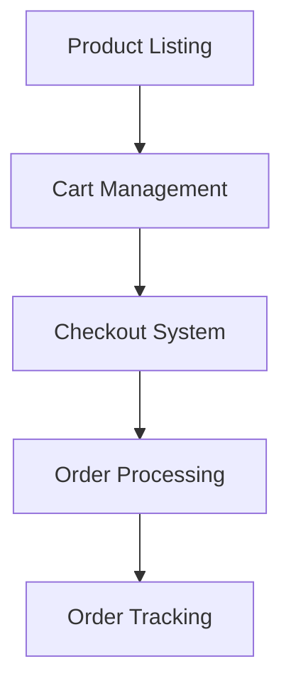

# 🛍️ Amazon Clone - JavaScript Implementation

## Project Overview  
This Amazon clone is a frontend e-commerce application focusing on core JavaScript functionality. Developed as part of an educational journey with SuperSimpleDev's YouTube course, this project demonstrates practical implementation of DOM manipulation, state management, and modular JavaScript architecture.

## Key Features
- **Shopping Cart System**:
  - Add/remove products
  - Quantity adjustment
  - Subtotal calculation
- **Checkout Flow**:
  - Delivery options selection
  - Payment simulation
- **Order Management**:
  - Order history tracking
  - Status updates
- **Responsive UI**: Pre-built responsive components (HTML/CSS provided by course)

## Technical Implementation
### Core Technologies
- Vanilla JavaScript (ES6+)
- Modular architecture
- DOM manipulation
- Event-driven programming

### Functional Components


## Project Structure
```
amazon-clone/
├── src/
│   ├── scripts/
│   │   ├── cart.js          # Cart logic & state management
│   │   ├── checkout.js      # Checkout processing
│   │   ├── orders.js        # Order history handling
│   │   └── tracking.js      # Order status updates
│   ├── data/
│   │   └── products.js      # Product dataset
│   └── styles/              # UI components
├── index.html               # Product catalog
├── checkout.html            # Checkout interface
├── orders.html              # Order history
└── tracking.html            # Order status
```

## Development Context
This project was developed while completing the following curriculum:

| Module | Concepts Applied |
|--------|------------------|
| JavaScript Fundamentals | DOM manipulation, Event handling |
| Advanced JS Concepts | Modules, OOP principles |
| Frontend Architecture | State management, Data flow |
| Practical Implementation | Cart systems, Checkout flows |

## Acknowledgments
Special thanks to [SuperSimpleDev](https://github.com/SuperSimpleDev) for providing the foundational HTML/CSS structure and comprehensive JavaScript curriculum through their YouTube course.

**Educational Resource**:  
[Frontend Web Development Course](https://www.youtube.com/watch?v=EerdGm-ehJQ) (SuperSimpleDev)
